# Modern Dormer Configurator

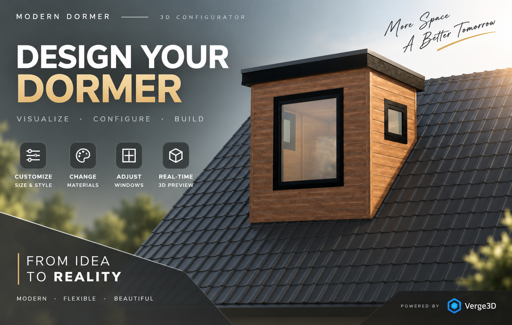

**Interactive Technical 3D configurator created as a Technical 3D Artist
assignment.**

**Tools:** Blender · Verge3D · Webflow

## 🚀 Live Demo

▶ **[Open Interactive Configurator](https://furniture-ui.webflow.io/)**

> Best viewed on desktop for the full interactive 3D experience.

------------------------------------------------------------------------

## Project Overview

Modern Dormer Configurator is an interactive 3D prototype that allows
users to configure a dormer in real time. The project focuses on modular
3D construction, clear configuration logic, animation, material
customization, and browser-based interaction.

The 3D scene and interactive logic were built with **Blender** and
**Verge3D**. The final interface was created in **Webflow** and
communicates with the Verge3D application through
`window.postMessage()`.

## Main Features

-   Overall Dormer Width: **1800 / 2200 / 2600 mm**
-   Overall Dormer Height: **2000 / 2200 / 2400 mm**
-   Front Window: **Single / Double / Triple**
-   Side Windows: **None / Left / Right / Both**
-   Front-window orientation switching
-   Horizontal / Vertical cladding
-   Cladding material customization
-   Window-frame color customization
-   Turn / Tilt window animation
-   Direct window interaction
-   Real-time 3D preview

> **Dimension Note:** Width and Height values in the configurator
> represent the **overall dormer dimensions**, based on the dimensions
> provided in the technical drawing. They do not represent only the
> internal frame or cladding area.

------------------------------------------------------------------------

## Technical Approach

The configurator uses a **modular variant system** rather than
generating geometry procedurally at runtime.

Shared components are reused whenever possible, while geometry that
genuinely changes between configurations is prepared as separate
variants in Blender. Verge3D Puzzles control visibility, transforms,
morph targets, materials, and animation.

This approach keeps the prototype predictable, easier to debug, and
suitable for a predefined configuration set.

### Configuration State

The main configuration is controlled through independent state values:

-   `current_width`
-   `current_Height`
-   `Side_Option`
-   `Cladding_Type`
-   `Front_window`

Each UI control changes only the state that it owns, then the scene is
updated using the current combination of states. This prevents one
configuration option from unintentionally overwriting another.

------------------------------------------------------------------------

# Verge3D Puzzle Breakdown

This section shows the main Puzzle systems used in the project and
explains what each one is responsible for.

## 1. Starter / Default State

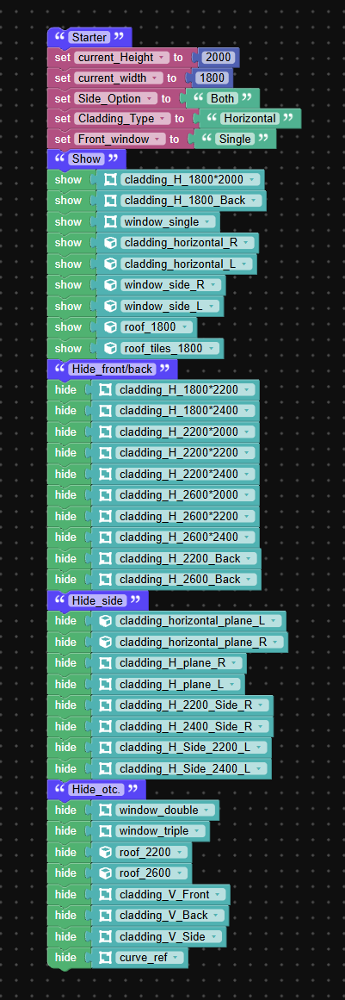

**Purpose:** Initializes the configurator when the application starts.

The Starter logic defines the default state:

-   Height → `2000`
-   Width → `1800`
-   Side Option → `"Both"`
-   Cladding Type → `"Horizontal"`
-   Front Window → `"Single"`

It also shows the default geometry and hides unused variants.

**Why it matters:** Starting from a known state makes the rest of the
configuration logic predictable and easier to debug.

------------------------------------------------------------------------

## 2. Size Configuration

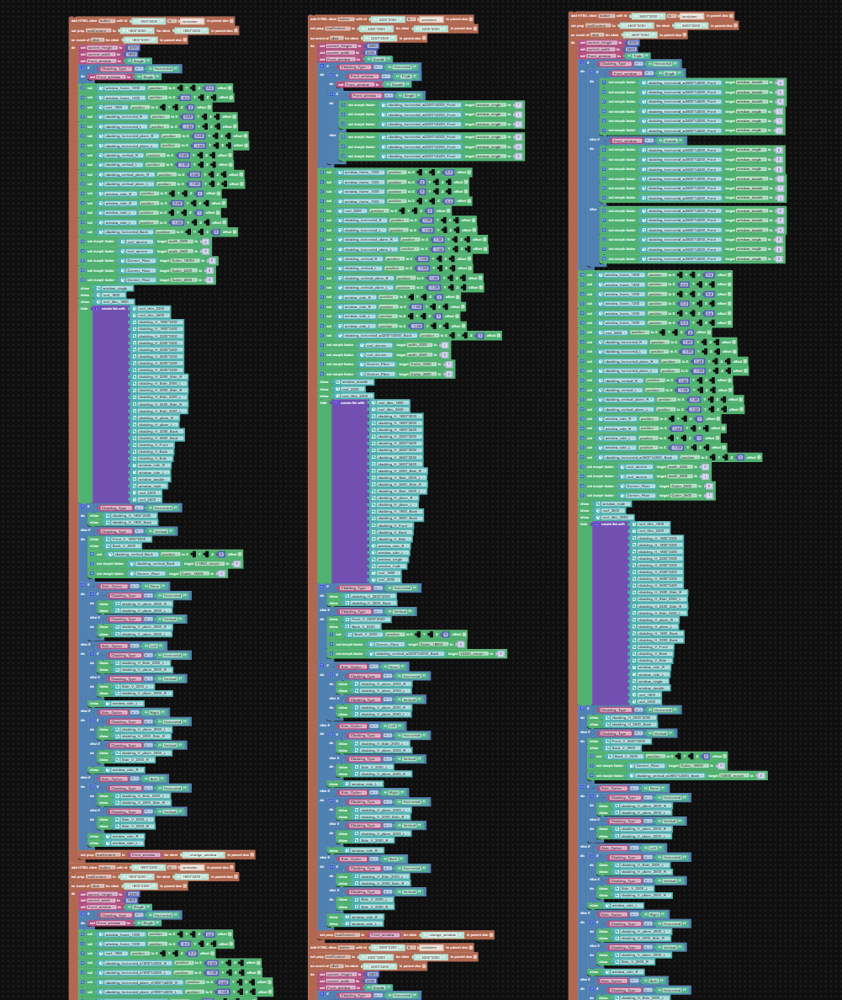

The size system manages the **3 widths × 3 heights**, creating nine
valid dormer-size combinations.

### Size Logic --- Part 1

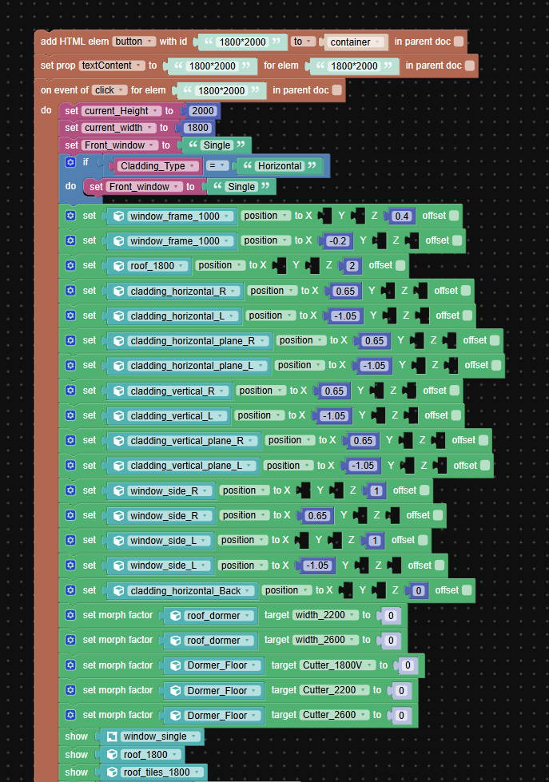

### Size Logic --- Part 2

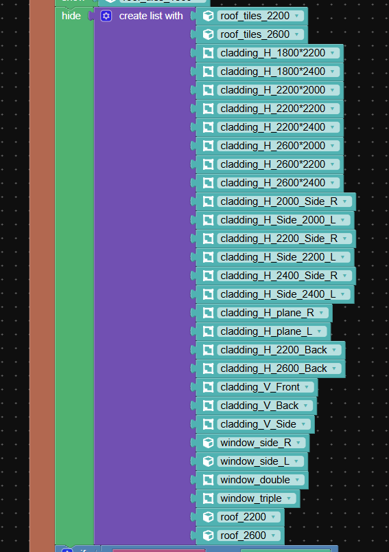

### Size Logic --- Part 3

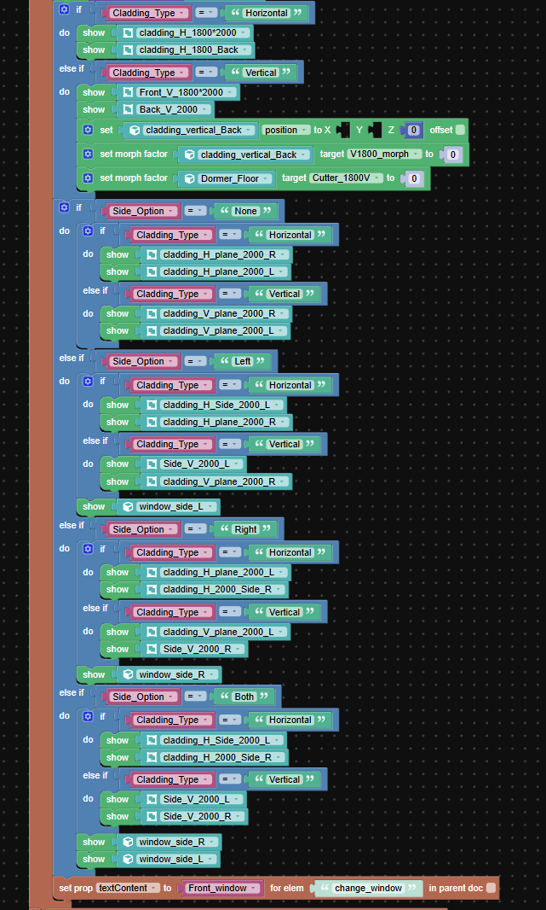

**Purpose:** Updates `current_width` and `current_Height`, then shows
and positions the correct geometry for the selected overall dormer size.

The size logic also updates dependent geometry such as:

-   Front/back cladding
-   Side components
-   Roof variants
-   Window positions
-   Morph targets

**Design decision:** Size controls own only the size state. Other
systems such as Side Option and Cladding Type keep their existing state.

------------------------------------------------------------------------

## 3. Front Window Configuration

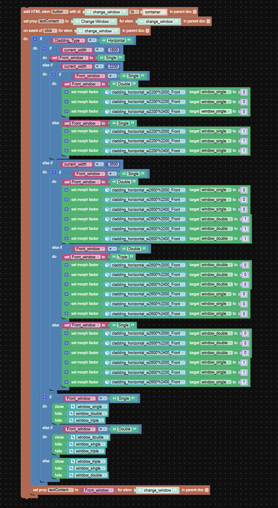

**Purpose:** Changes the front-window configuration while respecting the
available options for the current width.

  Overall Width   Available Front Windows
  --------------- --------------------------
  1800 mm         Single
  2200 mm         Single / Double
  2600 mm         Single / Double / Triple

For 2200 and 2600 widths, morph targets modify the surrounding front
cladding so the same configuration can adapt to the selected window
arrangement.

The visible window object is then switched between:

-   `window_single`
-   `window_double`
-   `window_triple`

**Why this approach:** It keeps the front-window system modular without
requiring runtime Boolean operations.

------------------------------------------------------------------------

## 4. Side Window Options

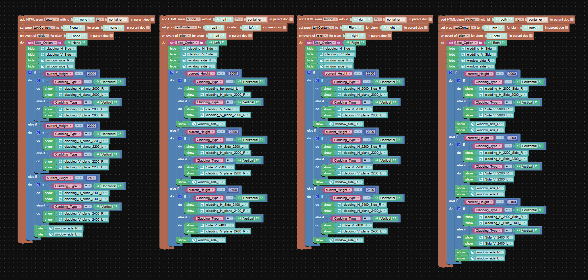

**Purpose:** Controls which side windows are available.

The four states are:

-   None
-   Left
-   Right
-   Both

The Puzzle uses both `Side_Option` and `current_Height` to show the
correct side cladding and window objects.

**Important architecture decision:** Side Option controls visibility,
while Size controls position and dimensions. Separating those
responsibilities prevents the two systems from overwriting each other.

------------------------------------------------------------------------

## 5. Horizontal / Vertical Cladding

### Cladding Logic --- Part 1

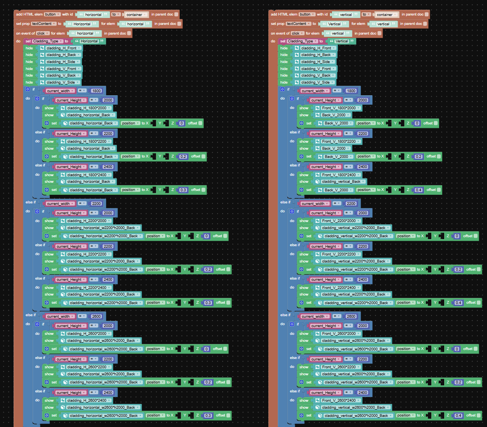

### Cladding Logic --- Part 2

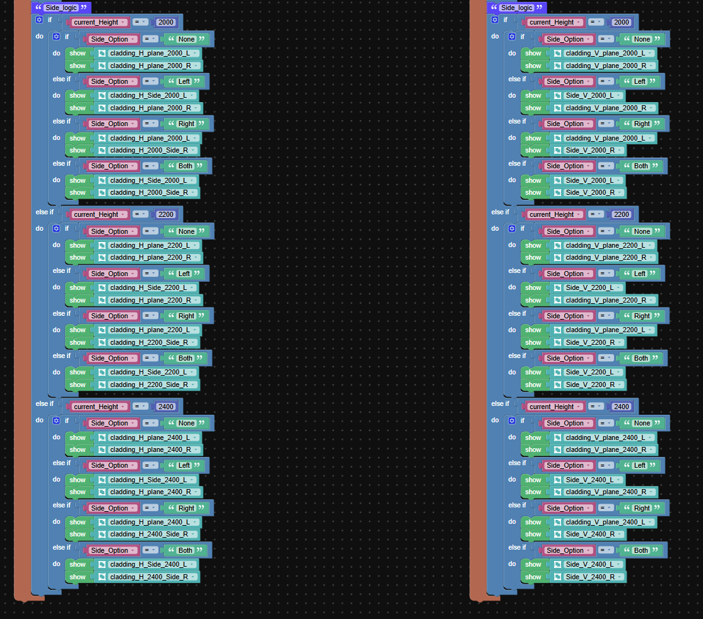

**Purpose:** Switches the dormer between Horizontal and Vertical
cladding while preserving the currently selected width, height, and
side-window state.

The categorical state is stored in:

`Cladding_Type`

with the text values:

-   `"Horizontal"`
-   `"Vertical"`

The logic selects the appropriate front, back, and side geometry for the
current configuration.

------------------------------------------------------------------------

## 6. Material & Window Frame Customization

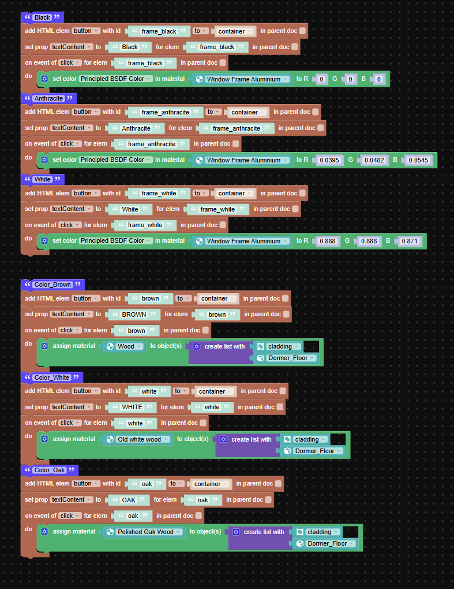

**Purpose:** Demonstrates independent material customization for
multiple parts of the dormer.

### Cladding Materials

-   Brown → Wood
-   White → Old White Wood
-   Oak → Polished Oak Wood

### Window Frame Colors

-   Black
-   Anthracite
-   White

The window-frame controls modify the Principled BSDF color of the shared
**Window Frame Aluminium** material, while the cladding controls assign
different materials to the cladding geometry.

**Why it matters:** Material configuration is independent from size,
cladding orientation, and window configuration.

------------------------------------------------------------------------

## 7. Window Animation & Direct Interaction

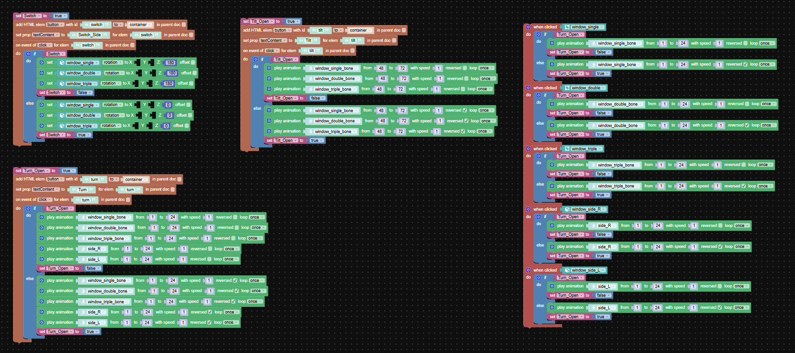

**Purpose:** Controls the tilt-and-turn style window animation.

### Turn

Frames **1--24**

### Tilt

Frames **48--72**

The global controls can animate multiple windows, while individual
window objects can also be clicked directly.

Each window variant uses its own armature.

**Problem solved during development:** A window variant originally moved
even with no parent because its Armature Modifier referenced another
variant's armature. Separating the armatures removed the hidden
dependency.

------------------------------------------------------------------------

## 8. Webflow → Verge3D Message Receiver

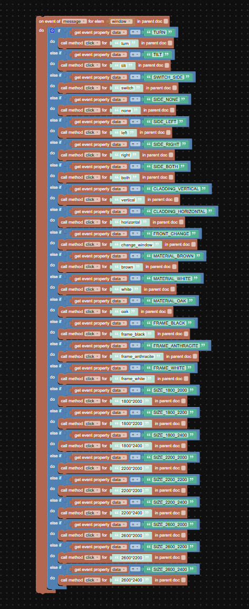

**Purpose:** Connects the external Webflow interface to the Verge3D
application.

The Webflow page sends commands through:

`window.postMessage()`

The Verge3D Puzzle listens for the `message` event, reads the incoming
command, and triggers the matching hidden internal button.

Example flow:

``` text
Webflow Button
      ↓
window.postMessage()
      ↓
Verge3D Message Receiver
      ↓
Hidden Verge3D Button
      ↓
Existing Puzzle Logic
      ↓
3D Scene
```

Example commands include:

-   `TURN`
-   `TILT`
-   `SWITCH_SIDE`
-   `SIDE_NONE`
-   `SIDE_LEFT`
-   `SIDE_RIGHT`
-   `SIDE_BOTH`
-   `CLADDING_HORIZONTAL`
-   `CLADDING_VERTICAL`
-   `FRONT_CHANGE`
-   Material and frame commands
-   Nine size commands

**Why this architecture:** The working Verge3D logic remains isolated
from the visible Webflow UI, making the integration easier to maintain
and debug.

------------------------------------------------------------------------

## Problem-Solving Notes

### Inconsistent Technical References

Some drawing views contained details that did not fully match. The
clearest front and side views were treated as the primary references,
while explicit dimensions remained authoritative. Unspecified details
were estimated only where necessary to maintain a visually consistent
prototype.

### Increasing Configuration Complexity

Combining width, height, windows, side options, cladding, materials, and
animation quickly increased the number of possible states.

Instead of creating a separate state for every possible combination, the
system was divided into independent configuration dimensions.

### Blender → Verge3D Hierarchy

Some parented objects behaved differently after export because parent
and child transforms could be applied redundantly. The hierarchy was
simplified and transforms were controlled at the appropriate object
level.

### Hidden Armature Dependency

A window variant moved unexpectedly even though it had no parent. The
actual dependency came from an Armature Modifier referencing another
variant's armature.

**Lesson:** No parent does not necessarily mean no dependency.
Modifiers, constraints, drivers, and animation relationships also need
to be checked.

### Configuration State Problem

Categorical state values initially behaved incorrectly when
uninitialized variables were used as constants. Literal text values such
as `"Horizontal"`, `"Vertical"`, `"None"`, `"Left"`, `"Right"`, and
`"Both"` were used instead.

### State Ownership

Each control was given responsibility for only its own state dimension:

-   Size → Width / Height
-   Side controls → Side Option
-   Cladding controls → Cladding Type
-   Front Window → Front Window state

This prevents one configuration system from accidentally resetting
another.

### Browser Cache During Testing

During publishing, updated Verge3D logic sometimes appeared not to work
even though the generated JavaScript contained the correct branches.

A hard refresh loaded the current published version.

**Lesson:** Verify the loaded version and browser cache before changing
working logic.

------------------------------------------------------------------------

## Final Architecture

``` text
Blender
  │
  │  Geometry / Materials / Armatures / Morph Targets
  ▼
Verge3D
  │
  │  Puzzles / State / Visibility / Animation
  ▼
Verge3D Web Application
  ▲
  │  window.postMessage()
  │
Webflow UI
```

------------------------------------------------------------------------

## Final Testing

The completed prototype was tested across:

-   All **9 Width × Height** combinations
-   Front-window options allowed by each width
-   Side Window: None / Left / Right / Both
-   Horizontal ↔ Vertical cladding
-   Brown / White / Oak materials
-   Black / Anthracite / White window frames
-   Turn / Tilt animation
-   Direct window interaction
-   State persistence after changing size and cladding
-   Published Webflow ↔ Verge3D communication

**Default configuration:**\
`1800 × 2000 / Single Front / Both Side / Horizontal / Brown / Black`

------------------------------------------------------------------------

## Project Structure

``` text
Modern_Dormer/
├─ assets/
├─ media/
├─ Doc/
│  ├─ Modern_Dormer_Hero.png
│  └─ Puzzle/
│     ├─ Starter.png
│     ├─ Button_Size_Overall.png
│     ├─ Button_Size_Part1.png
│     ├─ Button_Size_Part2.png
│     ├─ Button_Size_Part3.png
│     ├─ Change_window.png
│     ├─ Side_Options.png
│     ├─ Vertical_Horizontal_Part1.png
│     ├─ Vertical_Horizontal_Part2.png
│     ├─ Change_Materials.png
│     ├─ Window_Animation.png
│     └─ WebFlow_Receiver.png
├─ Technical_Assignment_Colengo_V001.blend
├─ Technical_Assignment_Colengo_V001.gltf
├─ Technical_Assignment_Colengo_V001.bin
├─ Technical_Assignment_Colengo_V001.html
├─ Technical_Assignment_Colengo_V001.css
├─ Technical_Assignment_Colengo_V001.js
├─ visual_logic.js
└─ visual_logic.xml
```

> Company-provided technical reference documents are intentionally not
> included in the public repository.

------------------------------------------------------------------------

## What I Learned

This assignment showed me how quickly an interactive 3D configurator can
become complex when several configuration systems need to work together.

The most important lesson was not only how to build each feature, but
how to structure the logic so that **geometry, state, animation,
materials, and UI remain independent and predictable**.

It also gave me practical experience connecting a Blender/Verge3D
application to an external Webflow interface and debugging issues across
the complete pipeline.

------------------------------------------------------------------------

## Built With

**Blender · Verge3D · Webflow**

▶ **[Try the Live Configurator](https://furniture-ui.webflow.io/)**
